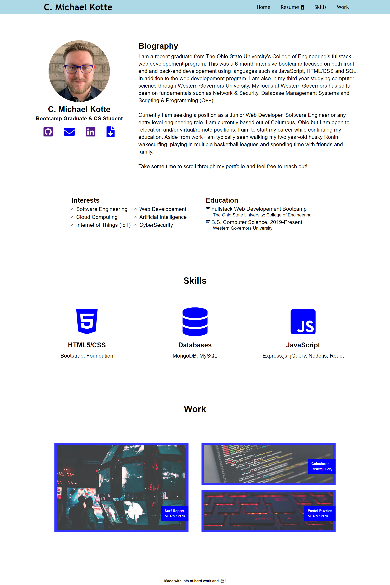

# Homework02 Advanced CSS: Portfolio

## My Task

This week I was assigned the task of creating a web application from scratch. More specifically building a portfolio page for myself, which I will continue to develop as the course progresses.

## Brief
```
AS AN employer
I WANT to view a potential employee's deployed portfolio of work samples
SO THAT I can review samples of their work and assess whether they're a good candidate for an open position
```

## Acceptance Criteria\

```
GIVEN I need to sample a potential employee's previous work
WHEN I load their portfolio
THEN I am presented with the developer's name, a recent photo, and links to sections about them, their work, and how to contact them
WHEN I click one of the links in the navigation
THEN the UI scrolls to the corresponding section
WHEN I click on the link to the section about their work
THEN the UI scrolls to a section with titled images of the developer's applications
WHEN I am presented with the developer's first application
THEN that application's image should be larger in size than the others
WHEN I click on the images of the applications
THEN I am taken to that deployed application
WHEN I resize the page or view the site on various screens and devices
THEN I am presented with a responsive layout that adapts to my viewport
```

## Completed Work

While creating this portfolio page I:
 
* Created a responsive webpage that will adapt to different viewports

* Included an About Me, Biography, Interests, Education, Skills and Work section

* Provided links for potential employers to contact me

* Made sure all links and references were correctly working

* Added proper indentation and spacing

* Added descriptive and best-practice comments to the CSS stylesheet.

* Properly implemented the styles requested 

* Structured the CSS stylesheet following semantic structure


## Screenshot of Completed Assignment




## Links

Deployed Application(GitHub Pages): https://mkotte.github.io/homework02/

GitHub Repository: https://github.com/mkotte/homework02